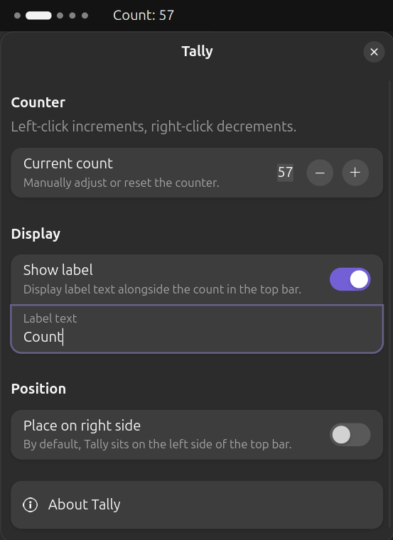

# Tally

A minimal click counter for the GNOME top bar.



## Usage

- Left-click the counter to increment
- Right-click the counter to decrement

The count persists across restarts and session locks as it is saved directly in GSettings.

## Preferences

| Option | Description |
|---|---|
| Current count | Manually adjust or reset the counter |
| Show label | Display a text label alongside the count in the top bar (default: false) |
| Label text | The text to show when the label is enabled |
| Place on right side | Move the counter to the right side of the top bar (default: false) |

## Installation

### From extensions.gnome.org (Review pending)

Search for 'Tally' or visit the [extension page](https://extensions.gnome.org) (review pending).

### Manual

Fetch the latest zip from [releases](https://github.com/hemish/tally/releases/latest).

```bash
# Extract into extensions folder
unzip tally@hemish.net.zip -d ~/.local/share/gnome-shell/extensions/tally@hemish.net/

# Compile the schema
glib-compile-schemas ~/.local/share/gnome-shell/extensions/tally@hemish.net/schemas/

# Log out and back in, then enable
gnome-extensions enable tally@hemish.net
```

## Requirements

- GNOME Shell 49 or later

## License

GPL-3.0-or-later